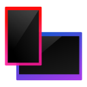

# Markuse arvuti asjad (Av2)

Uued Markuse arvuti asjade programmid, mis vastavad Markuse asjad Av2 standarditele.


## Integratsiooniprogramm


### Ühilduvad väljaanded
* Premium (`IP` erifunktsiooniga)
* Pro (`IP` erifunktsiooniga)

### Funktsioonid

* Verifile 2.x ühilduvus
* Erifunktsioonide saadavalolevuse kontrollimine
* Uus konfiguratsioonifaili süsteem menüü üksuste valimiseks
* Ilma akendeta käivitumine
* Mälupulga juhtpaneeli kopeerimine ja käivitamine
* Mälupulga juhtpaneeli automaatne käivitamine seadme sisestamisel
* Tahvelarvuti/nutitelefoni sidumine kinnituskoodiga
* Töölauamärkmete kuvamine/peitmine
* Perioodilised Markuse asjade püsivuskontrollid (Verifile)
* Seadete automaatne uuesti laadimine nende muutmisel (nt Markuse arvuti juhtpaneeli kaudu)
* Teabeaken (käivitatav menüüst või faili <MAS_ROOT>/showabout.txt loomisel)
* Ajastatud toimingute tugi - skripti käivitamine kindlal kuupäeval ja kellaajal
* Põhjalik logimine
* Uus ikoon :)

### Konfigureerimine

1. Juuruta arvuti vastavalt Markuse asjad süsteemi nõuetele
2. Loo Markuse asjade juurkaustas kataloog "integration_data"
3. Lisa sinna konfiguratsioonifail "Config.json" sarnase sisuga
    ```json
      {
        "MenuItems": [
          {
              "MenuIdentifier": "OpenMasStuff",
              "SubItems": null,
              "StatePoller": null,
              "States": [
                  {
                      "StateIdentifier": "Default",
                      "Label": "Ava Markuse kaustad",
                      "IconPath": "%MAS_ROOT%/integration_data/folder.png",
                      "Action": "default::OpenHomeDir"
                  }
              ],
              "RequiredFeatures": "MM"
          }
        ]
      }
    ```
4. Lisa sinna ka `folder.png` (ikoon selle menüü elemendi jaoks)
5. Nüüd peaks selle programmi käivitamine õnnestuma ja tegumiriba ikooni menüüs on üks element: "Ava Markuse kaustad", millelele klikkides avaneb kasutajakataloog

### Attribuutide ülevaade

* MenuItems - menüü elementide list
  * MenuIdentifier - ID menüü elemendi jaoks (unikaalne, ilma tühikuteta)
  * SubItems (valikuline) - menüü elemendi alammenüü
  * StatePoller (valikuline) - määrab tingimuse, mille järgi elemendi olek valitakse
    * näide: `IS_TRUE(AllowCode) ? Default : Forbidden` (hetkel on võimalik kasutada kuni 2 olekut)
  * States - list olekutest, vaikesättena kasutatakse "Default" olekut. Erivariant on ka "Gray" olek, kus menüü elementi ei saa klikkida.
    * StateIdentifier - oleku ID, kui menüü element ei muutu kunagi, siis võiks states listis olla ainult üks "Default" ID-ga element
    * Label - silt, mis kuvatakse kasutajale selles olekus
    * IconPath - menüü elemendi ikoon selles olekus
    * Action (valikuline) - tegevus, mis on seotud selle menüü elemendiga, formaadis `liik::tegevus`, saadaval on 3 liiki tegevusi
      * shell - käivita käsklus operatsioonisüsteemi kestal
      * default - käivita sisseehitatud käsklus (vt DefaultActions.cs)
      * web - veebiaadress, avab brauseris
  * RequiredFeatures (valikuline) - väljaandest sõltumatud nõutud erifunktsioonid kasutamiseks (eraldatud sidekriipsudega), juhul kui nõue pole saavutatud, ei ole elementi võimalik klikkida
    * MM - juurutatud Markuse asjade süsteem (standardfunktsioonid)
    * IP - integratsiooniprogramm
    * IT - interaktiivne töölaud
    * GP - grupipoliitika
    * CS - klassikaline stardimenüü
    * WX - Windows 10+
    * RD - kaugtöölauaühendus
    * DX - DesktopX (pärand)
    * RM - Rainmeter
    * LT - LiveTuner optimeerimised

Teatud attribuutide jaoks on võimalik kasutada ka %MAS_ROOT% muutujat, mis viitab Markuse asjade juurkataloogile.

### Arendaja valikud

Kui silute programmi, kuvatakse menüüelemendid, mille ID-s on sõne "Debug".

Kui soovite testida erinevate akende funktsionaalsust, käivitage programm parameetriga `--interface-test`.

Võimalik on sisse lülitada ka põhjalik logimine. Selleks lisage kasutaja kodukausta fail `.MAS_VERBOSE_LOG`. Sellesse faili lähebki põhjaliku logi sisu.

### Veaotsing

* Verifile räsi pole usaldusväärne
  * Markuse asjade juurkataloogi ei eksisteeri 
  * Markuse asjade juurkataloogis ei ole faili "verifile2.jar"
  * Markuse asjade juurkataloogis olev "verifile2.jar" fail ei pärine [mas-corefiles](https://github.com/MarkusMaal/mas-corefiles) repositooriumist
* Arvuti pole õigesti juurutatud, kood VF_FAILED
  * Java JRE 21+ pole paigaldatud
  * Java pole PATHis ja/või JAVA_HOMEis
  * Verifile programmirike
* Arvuti pole õigesti juurutatud, kood VF_TAMPERED
  * Faile edition.txt või verifile2.dat on muudetud ilma juurutamise tööriistata
  * Fail(id) edition.txt ja/või verifile2.dat pärinevad teisest arvutist
* Arvuti pole õigesti juurutatud, kood VF_LEGACY
  * Faili verifile2.dat ei eksisteeri Markuse asjade juurkataloogis
* Arvuti pole õigesti juurutatud, kood VF_FOREIGN
  * Faili edition.txt ei eksisteeri Markuse asjade juurkataloogis
* Arvuti pole õigesti juurutatud, kood VF_MISSING_FILES
  * Integratsiooniprogrammi tööks vajalikke faile ei eksisteeri Markuse asjade juurkataloogis (kasuta juurutamise tööriistas "soorita testid" funktsiooni)
* Tohoh, see on nüüd küll piinlik/kadumine tegumiribalt
  * Koodiviga, analüüsi siluriga
* Väljaanne ei toeta integratsiooniprogrammi (mõni sekund pärast käivitumist)
  * Väljaande erifunktsioonide listis puudub märge integratsiooniprogrammi (IP) jaoks

## Seadmehaldur



### Ühilduvad väljaanded
* Premium (`RD` erifunktsiooniga)
* Pro (`RD` funktsiooniga)

### Funktsioonid

* Seadmete lisamine/eemaldamine kaugjuhtimiseks (M.A.I.A. või MasAPI jaoks)
* Lisatud seadmete kuvamine listis koos ikoonidega
* Seadme lisamisel IP aadressi valideerimine
* Vajalike failide olemasolu kontrollimine ja ebaõnnestumisel kasutajale vastava veateate kuvamine

### Konfigureerimine

* Loo Markuse asjade juurkataloogis "mas_neoglass" kaust ja lisa sinna ikoonid erinevate seadmete jaoks, mida see programm otsib
* Klooni maia Markuse asjade juurkataloogi (alamkaust "maia") või lihtsalt loo tühi kaust nimega "maia"
* Lisa sinna kausta tühi fail nimega "whitelist.txt" kui seda seal pole
* Valikuline väljaande funktsioon "RD" peab olema sisse lülitatud
* Lisa otsetee Integratsiooniprogrammi menüüsse (vt Integratsiooniprogramm > Konfigureerimine)
* Taaskäivita Markuse asjad (juhtpaneeli kaudu)
